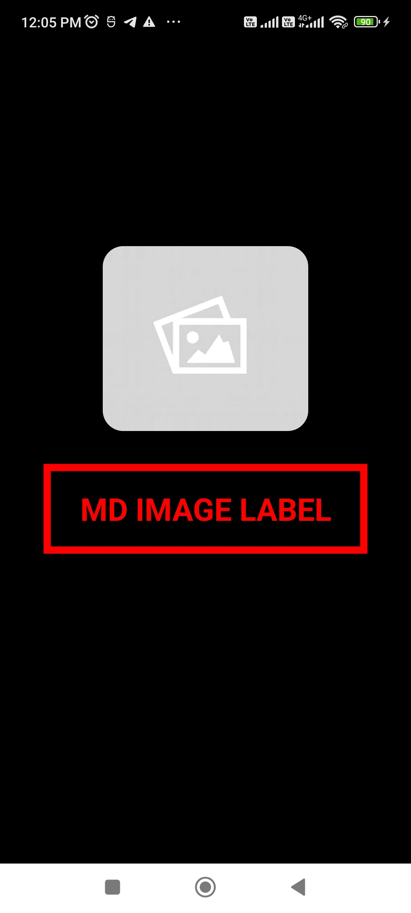
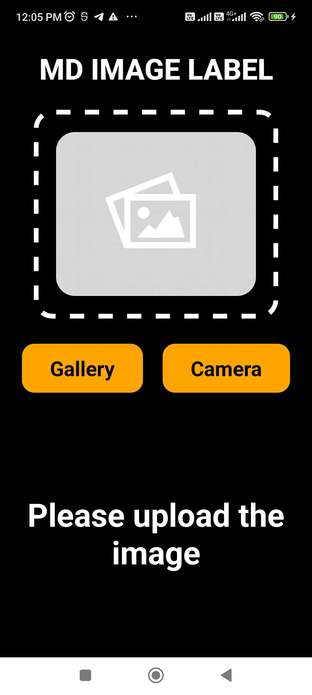
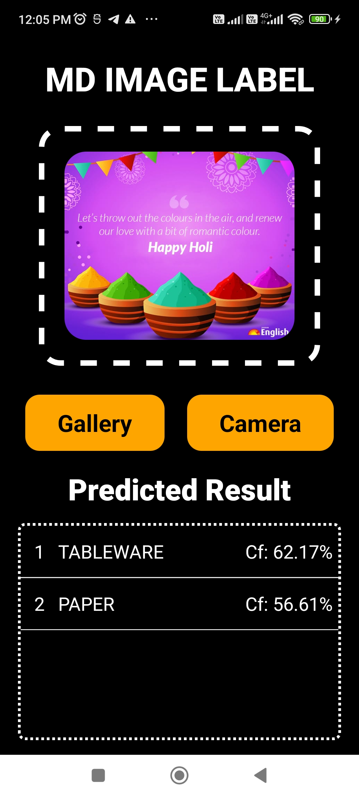

# mdImageLabel App Documentation

## Overview
mdImageLabel is a mobile application developed using React Native, designed to predict labels for uploaded images using ML Kit Image Labeling. The app allows users to upload images from the device's gallery or capture them using the camera. Upon selecting an image, the app utilizes ML Kit Image Labeling to predict and display relevant labels for the image.

## Features
- Image label prediction based on uploaded images
- Support for selecting images from the device's gallery
- Camera integration for capturing images
- Responsive layout design
- Toast messages for user feedback

## Screenshots

### 1. Splash Screen

*Description: This screenshot displays the splash screen of the mdImageLabel app.*

### 2. Home Screen

*Description: This screenshot shows the home screen of the mdImageLabel app.*

### 3. Image Prediction Result

*Description: This screenshot displays an uploaded image along with the predicted labels by the app.*

## Installation
To install and run the mdImageLabel app on your development environment, follow these steps:

1. Clone the repository:

2. Navigate to the project directory:

3. Install dependencies:

4. Run the app:

## Libraries Used
- [@react-native-ml-kit/image-labeling](https://www.npmjs.com/package/@react-native-ml-kit/image-labeling): Library for image label prediction using ML Kit
- [react-native-image-picker](https://www.npmjs.com/package/react-native-image-picker): Library for selecting images from the device's gallery or capturing images using the camera
- [react-native-responsive-dimensions](https://www.npmjs.com/package/react-native-responsive-dimensions): Library for creating responsive layouts
- [react-native-toast-message](https://www.npmjs.com/package/react-native-toast-message): Library for displaying toast messages

## Configuration for Android
To generate an Android App Bundle (AAB) file for the mdImageLabel app, follow these steps:

1. Add a keystore file to the `android/app` folder.
2. Configure the `gradle.properties` file inside the `android` folder by adding the following details:

MYAPP_UPLOAD_STORE_FILE=<your_keystore_file_name>
MYAPP_UPLOAD_KEY_ALIAS=<your_key_alias>
MYAPP_UPLOAD_STORE_PASSWORD=<your_keystore_password>
MYAPP_UPLOAD_KEY_PASSWORD=<your_key_password>

3. Open a terminal and navigate to the `android` location of your project.
4. Run the following command to generate the AAB file:

./gradlew bundleRelease

This command generates the release version of the AAB file for your app.

5. Once the command finishes executing, you can find the generated AAB file in the `android/app/build/outputs/bundle/release` directory.

## Usage
1. Open the mdImageLabel app on your mobile device.
2. Choose an option to either select an image from the gallery or capture a new image using the camera.
3. After selecting/capturing an image, wait for the ML Kit Image Labeling process to complete.
4. Once processed, the app will display relevant labels for the uploaded image.
5. Navigate through the app to explore different images and their corresponding labels.

## Contributors
- Mayur Desai

## License
This project is licensed under the [license](https://sites.google.com/view/mdimagelabel/home). See the LICENSE file for details.

## Support
For any inquiries or support regarding the mdImageLabel app, please contact [msdesai32@gmail.com](msdesai32@gmail.com).

---
Feel free to customize this documentation to fit your project's specific requirements and branding guidelines.
